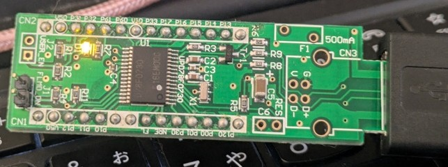

2008年8月号のトランジスタ技術付録基板だと思われるマイコン基板(UPD78F0730)をアセンブリ言語で動かしてみました。

※トラ技BIOSが書き込まれている場合は削除されます。

### WriteEZ5での書き込み

- あらかじめパラメータファイル等の設定をしておく。(Frequency=16.00MHz,Multiply rate=1.00)
- 書き込み治具を経由してPCと接続する。ポートの設定をする。
- 生成したhexファイルを読み込む（生成するたびに読み込ませる）
- AutoProcedure(Epv)で書き込み
